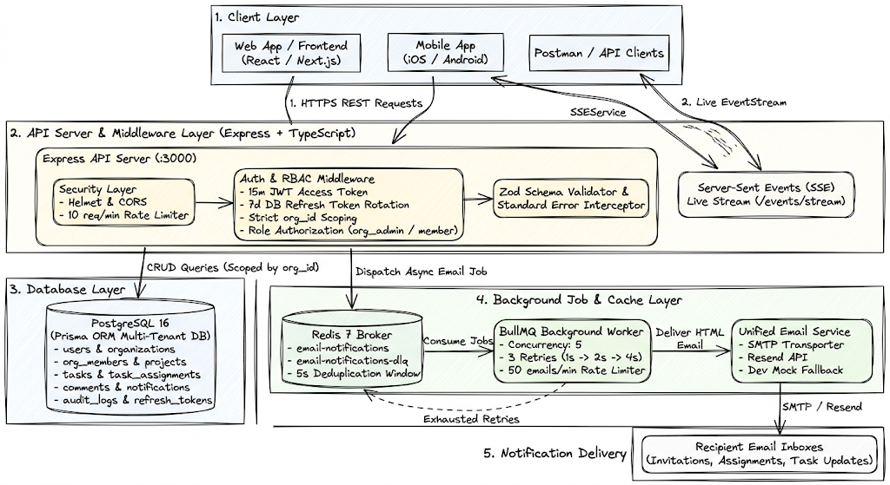

# TaskFlow — Multi-Tenant Project Management Backend

[](https://www.typescriptlang.org/)
[](https://nodejs.org/)
[](https://expressjs.com/)
[](https://www.postgresql.org/)
[](https://www.prisma.io/)
[](https://redis.io/)
[](https://bullmq.io/)
[](https://www.docker.com/)
[](https://jestjs.io/)

TaskFlow is an enterprise-grade, multi-tenant project management backend designed with **clean architecture**, **strict tenant isolation**, **resilient asynchronous background jobs**, **real-time Server-Sent Events (SSE)**, and **comprehensive API documentation**.

---

## 🏛️ System Architecture

<p align="center">
  
</p>

---

## 🌟 Core Technical Highlights

- **Multi-Tenant Isolation**: Strict row-level scoping via JWT context (`orgId`, `userId`, `role`). Client-supplied `org_id` is never trusted; cross-tenant access returns standard `403 Forbidden` (`FORBIDDEN`).
- **PostgreSQL Database Design**:
  - Tables: `users`, `organizations`, `org_members`, `projects`, `tasks`, `task_assignments`, `comments`, `notifications`, `audit_logs`, `refresh_tokens`.
  - Documented `CASCADE` vs `RESTRICT` foreign key rules.
  - Native PostgreSQL enums: `OrgRole`, `TaskStatus`, `TaskPriority`, `NotificationType`.
  - Composite indexes on `(project_id, status, deleted_at)`, `(org_id, deleted_at)`, `(due_date)`, and `(user_id)`.
  - Soft delete support (`deleted_at`) on projects & tasks.
  - PostgreSQL full-text search.
- **Authentication & RBAC**:
  - `POST /auth/register`, `POST /auth/login`, `POST /auth/refresh`, `POST /auth/logout`, `POST /auth/logout-all`.
  - **OAuth 2.0 (Google & GitHub)**: `POST /auth/oauth/google`, `POST /auth/oauth/github`.
  - `bcrypt` password hashing with cost factor $\ge 12$.
  - 15-minute JWT access token + 7-day refresh token in DB with **Refresh Token Rotation & Family Theft Detection**.
  - Rate limiting on authentication endpoints (**10 requests/minute/IP**).
  - RBAC roles (`org_admin`, `member`) where admins can manage members and delete projects.
- **In-App Notifications & Real-Time SSE**:
  - `GET /notifications` (paginated list with unread counter).
  - `PATCH /notifications/:id/read` & `PATCH /notifications/read-all`.
  - `GET /events/stream` (Live Server-Sent Events stream for instant real-time dashboard updates).
- **Activity & Audit Logs**:
  - `GET /tasks/:taskId/activity` & `GET /projects/:projectId/activity` (Full history of task/project changes).
- **REST API - Projects & Tasks**:
  - Clean `Route -> Controller -> Service -> DB` layered architecture.
  - Full CRUD for projects and tasks.
  - Filters: `status`, `priority`, `assigneeId`, `dueDateStart`, `dueDateEnd`, `search`.
  - **Dual Pagination**: **Offset pagination** (`{ data, total, page, limit }`) and **Cursor pagination** (`{ data, next_cursor }`).
  - Zod validation for all request payloads.
  - Task assignment/unassignment with same-organization validation.
  - Project dashboard metrics endpoint with task counts grouped by status.
  - **Bonus**: Bulk task status update endpoint (`PATCH /tasks/bulk-status`).
- **Background Jobs & Email Notifications (BullMQ + Redis)**:
  - Asynchronous email notifications on task assignment, member invites, task changes, and comments.
  - Unified Email Service supporting **Nodemailer SMTP** (Gmail, Mailtrap, Brevo, AWS SES), **Resend API**, and **Dev Mock transporter**.
  - Direct testing endpoint: `POST /email/test`.
  - 3 retries with exponential backoff ($1\text{s} \to 2\text{s} \to 4\text{s}$).
  - Dead-Letter Queue (`email-notifications-dlq`) for exhausted retries.
  - `GET /jobs/:id` endpoint for inspecting job status (`pending`, `active`, `completed`, `failed`).
  - 5-second task assignment deduplication.
  - Global email rate limit (50 emails/minute).
- **API Documentation & Testing**:
  - Interactive Swagger UI at `http://localhost:3000/api-docs`.
  - Ready-to-import Postman collection: [`TaskFlow.postman_collection.json`](./TaskFlow.postman_collection.json).
  - **24 automated unit & integration tests passing** with Jest & Supertest.

---

## 🚀 Quick Start with Docker Compose (Recommended)

Start the complete stack (API, Worker, PostgreSQL, Redis) with a single command:

```bash
docker compose up --build
```

The services will start on:
- **API Server**: `http://localhost:3000`
- **Swagger UI**: `http://localhost:3000/api-docs`
- **PostgreSQL**: `localhost:5432`
- **Redis**: `localhost:6379`

To seed demo data into the running Docker container:
```bash
docker compose exec api npm run prisma:seed
```

---

## 🛠️ Local Development Setup (Bare Metal)

### 1. Prerequisites
- **Node.js** >= 18.x / 20.x
- **PostgreSQL** 15+ running locally
- **Redis** 6+ running locally

### 2. Install Dependencies
```bash
npm install
```

### 3. Environment Variables
Copy `.env.example` to `.env`:
```bash
cp .env.example .env
```

### 4. Database Migrations & Seeding
```bash
# Run Prisma migrations
npx prisma migrate dev --name init

# Seed database with sample data (2 orgs, 5 users, 12 tasks, assignments, comments)
npm run prisma:seed
```

### 5. Start the API Server & Background Worker
```bash
# Terminal 1 - Start API Server
npm run dev

# Terminal 2 - Start BullMQ Background Worker
npm run dev:worker
```

---

## 🧪 Running Automated Tests

Run the complete test suite (Unit & Integration tests):
```bash
npm test
```

Generate a test coverage report:
```bash
npm run test:coverage
```

---

## 📖 API Documentation & Postman Collection

### 1. Swagger UI
Access the interactive OpenAPI 3.0 documentation at:
**`http://localhost:3000/api-docs`**

### 2. Postman Collection
Import [`TaskFlow.postman_collection.json`](./TaskFlow.postman_collection.json) directly into Postman.
- Pre-configured with `{{baseUrl}}` and auto-token capture on Login & Register.
- Default seeded test accounts:
  - **Admin User (Org 1 - Acme Corp)**: `alice@acme.com` / `Password123!`
  - **Member User (Org 1 - Acme Corp)**: `bob@acme.com` / `Password123!`
  - **Admin User (Org 2 - Stark Industries)**: `dave@stark.com` / `Password123!`

---

## 📂 Seeded Demo Data Overview

| User Email | Organization | Role | Sample Data |
| :--- | :--- | :--- | :--- |
| `alice@acme.com` | Acme Corporation | `org_admin` | 2 Projects, 9 Tasks, Comments |
| `bob@acme.com` | Acme Corporation | `member` | Assigned tasks, comments |
| `charlie@acme.com` | Acme Corporation | `member` | Assigned tasks, comments |
| `dave@stark.com` | Stark Industries | `org_admin` | 1 Project, 3 Tasks |
| `eve@stark.com` | Stark Industries | `member` | Assigned tasks |

---

## 🏗️ Project Directory Structure

```
.
├── docker-compose.yml          # Multi-container orchestration (api, worker, postgres, redis)
├── Dockerfile                  # Multi-stage Docker build with Alpine OpenSSL support
├── package.json                # Dependencies and npm scripts
├── tsconfig.json               # TypeScript configuration
├── TaskFlow.postman_collection.json # Ready-to-import Postman collection
├── docs/
│   └── architecture.png        # System architecture diagram
├── prisma/
│   ├── schema.prisma           # Prisma schema with models, enums, FK constraints, and indexes
│   ├── seed.ts                 # Database seed script
│   └── migrations/             # Migration SQL files
├── src/
│   ├── app.ts                  # Express app setup with middleware & routes
│   ├── server.ts               # Server entry point
│   ├── config/                 # Environment variables & constants
│   ├── database/               # Prisma singleton client
│   ├── queues/                 # BullMQ queue & deduplication logic
│   ├── workers/                # BullMQ background email worker
│   ├── middleware/             # Auth JWT, RBAC, Rate limiting, Error handler, Zod validator
│   ├── common/
│   │   ├── errors/             # AppError & specialized error classes
│   │   ├── utils/              # EmailService, JWT, password hashing, pagination
│   │   └── validators/         # Zod schemas
│   ├── docs/                   # OpenAPI / Swagger definition
│   └── modules/
│       ├── auth/               # Register, Login, Refresh, Logout, Logout-all, OAuth
│       ├── organizations/      # Org member management
│       ├── projects/           # Projects CRUD & dashboard stats
│       ├── tasks/              # Tasks CRUD, filters, pagination, assignment, bulk status
│       ├── comments/           # Task comments CRUD
│       ├── notifications/      # In-app notifications & read/unread management
│       ├── events/             # Real-time SSE event stream
│       ├── email/              # SMTP & email delivery test endpoints
│       ├── audit/              # Activity and audit log queries
│       └── jobs/               # BullMQ job status inspection (GET /jobs/:id)
└── tests/
    ├── setup.ts                # Test setup configuration
    ├── unit/                   # Unit tests (auth, cryptography, pagination, validation)
    └── integration/            # Integration tests (Supertest API, RBAC, cross-tenant 403)
```
